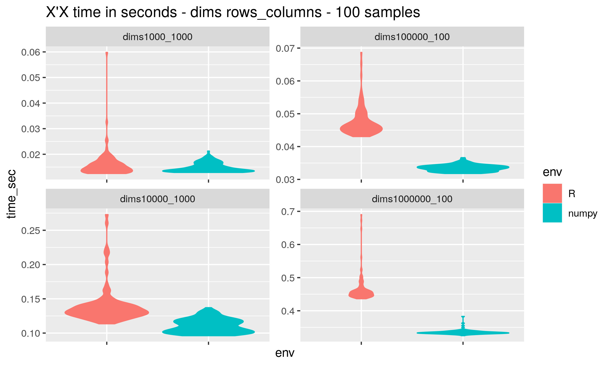

# Benchmarks R vs Python

Using RStudio and the reticulate package to benchmark important algorithms across R and Python environments

[**reticulate**](http://blog.rstudio.com/2018/03/26/reticulate-r-interface-to-python/)

Environment: Ubuntu 18 openblas R 3.6.3 python 3.7.4 i7 6700HQ 24G DDR4 2133

`sudo apt-get install libopenblas-dev`

Hypothesis: There is no significant gap in an algorithms performance between R and Python environments.

*Algebra operations, OLS and in development phase RandomForest,random numbers generators (Mersenne-Twister, ...), NN and Xgb*

Proc usage was calculated by R function `microbenchmark::get_nanotime` and Python method `time.clock`

### Algebra - X'X

X'X takes around mn^2 flops ( the 2 power were reduced during last years but it will be always exponential).  
So time growing linear with additional rows and quadratic with additional columns.

### Algebra - solve linear system with a left multiplication by X'

XB=Y - mostly it is a overdetermined system   
or X'XB=X'Y - where X'X is a square matrix

### OLS - Ordinary Least Squares

OLS consists of solving linear systems with usage of cholesky,QR or LU matrix decomposition

Example under QR decomposition:

### Random Forest

### NN

### XGB